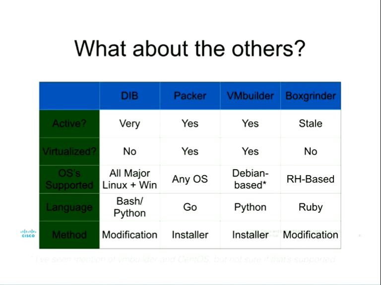
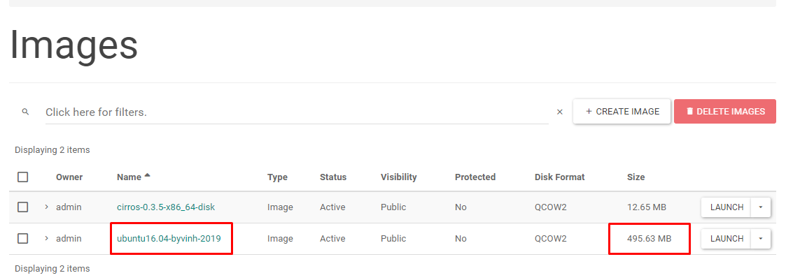
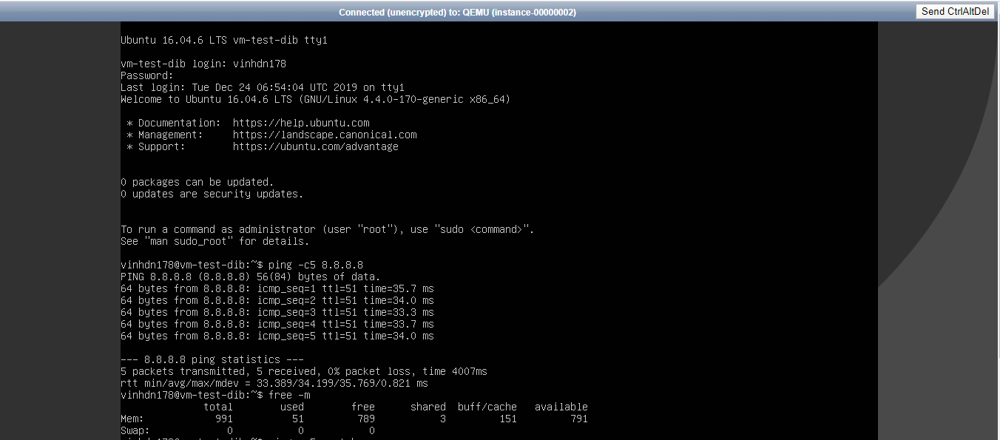
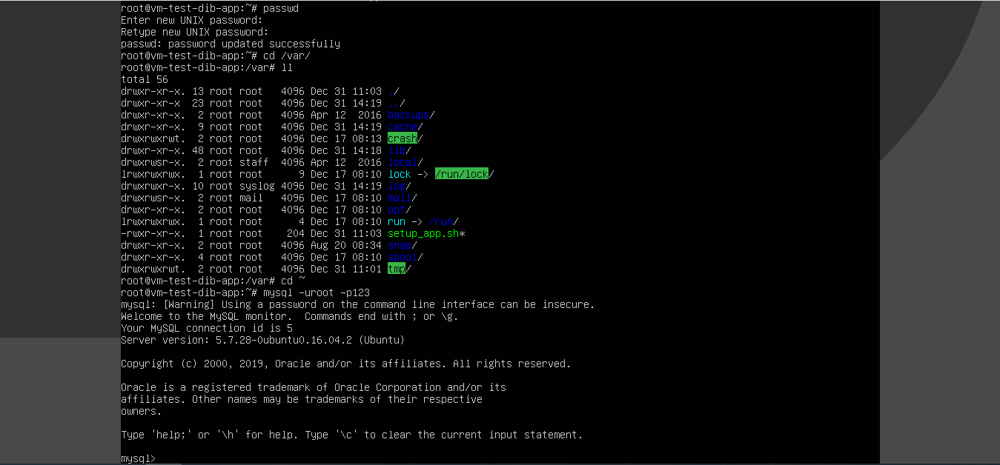

# Disk image Builder (DIB)

## Mục lục 
- [1. Giới thiệu](#1)
- [2. Thành phần](#2)
- [3. Tạo Image bằng DIB](#3)
- [4. Tạo elements](#4)
---
<a name="1"></a>
## 1. Giới thiệu
### 1.1 Khái niệm
- Diskimage-builder là một công cụ dựng OS disk image của Openstack.

- DIB còn cho phép bạn Customise OS disk image cho nhiều các distributions của Linux và có thể sử dụng Disk image đó trên nhiều các cloud provider khác như AWS hoặc Azure.

- Cho phép bạn tạo một Image theo format tùy chọn mà không cần thao tác tạo OS như bình thường.

### 1.2 OS support to build Images

- Distro được support để là host build Image:
    
    -  Centos 6, 7

    - Debian 8 (“jessie”)

    - Fedora 28, 29, 30

    - RHEL 6, 7

    - Ubuntu 14.04 (“trusty”)

    - Gentoo

    - openSUSE Leap 42.3, 15.0, 15.1 and Tumbleweed

- Distro được support tạo thành Image : 
     
    -  Centos 6, 7

    - Debian 8 (“jessie”)

    - Fedora 28, 29, 30

    - RHEL 6, 7

    - Ubuntu 12.04 (“precise”), 14.04 (“trusty”)

    - Gentoo

    - openSUSE Leap 42.3, 15.0, 15.1 and Tumbleweed (opensuse-minimal only)

### 1.3 So sánh với các tools khác 


(https://www.virtualization.net/creating-custom-elements-for-diskimage-builder-9798/)

<a name="2"></a>
## 2. Thành phần 

*Thành phần chính của Diskimage là command bao gồm các element và các biến môi trường cho mỗi element.*

- Các element được thêm vào qua command. Element là cách quyết định chuyện gì xảy ra với image và những sửa đổi gì sẽ được thực hiện. 

- Các element được hiểu như các OS , Distro, các gói cài đặt hoặc các đoạn script cài đặt cho disk image

- Bạn có thể tự tạo element bằng cách viết các đoạn script để customise cho Image.

- List các element tham khảo tại: https://docs.openstack.org/diskimage-builder/latest/elements.html

- Một image  được tạo ra thì sẽ mặc định formats là `qcow2`. Nếu muốn sử dụng format khác bằng cách chèn `-t <format>` sử dụng cách format được hỗ trợ:
    - qcow2
    - tar
    - tgz
    - squashfs
    - vhd
    - docker
    -raw

- **Phase Subdirectories**: Là các thư mục nằm trong 1 elements sẽ chạy các đoạn cấu hình hoặc script để tùy chỉnh các process khi dựng image
    
    -  root.d : Tạo hoặc tùy chỉnh nội dung ban đầu cho filesystem, chỉ chọn được duy nhất 1 elements để customise phần này `i386|amd64|armhf|arm64`

    - extra-data.d: Kéo thêm các data như  SSH keys, http proxy settings

    - pre-install.d : Cài đặt apt repo ( nơi lưu trữ các chương trình cài đặt)

    - install.d: Đây là bước thường để cài đặt các package

    - post-install.d: Cấu hình các gói đã được cài .

    - post-root.d: 

    - block-device.d : Tạo phân vùng

    - pre-finalise.d

    - finalise.d

    - cleanup.d

Tham khảo thêm tại: https://docs.openstack.org/diskimage-builder/latest/developer/developing_elements.html
<a name="3"></a>

## 3. Tạo Image bằng DIB

*Thực hiện trên Centos7*

- Bước 1: Để cài đặt cần cài đặt các tools mặc định để DIB tương tác với image:
   
    - Cài đặt `qeum-image` (Để convert image sang dạng qcow2)
    
    ``` yum install -y qemu-img ```
    - Cài đặt ` kpartx` để tạo các phân vùng trong Image:
    
    ``` yum install -y kpartx ```
    - Cài đặt các tools hỗ trợ trong quá trình cài đặt :
    
    ```yum install -y squashfs-tools  ```
    - Tùy chọn 
        - Bạn có thể cài các tools KVM/QEUM để sau khi tạo được image có thể tương tác truy nhập vào image để test:
        
         ``` yum install -y qemu-kvm qemu-img virt-manager libvirt libvirt-python libvirt-client virt-install virt-viewer ```
        - công cụ `guestfish` để tương tác với image:
        
         ``` yum -y install guestfish ```

- Bước 2: Clone Repo và cài đặt biến môi trường
 ``` 
git clone http://github.com/openstack/diskimage-builder

cd diskimage-builder

sudo pip install -r requirements.txt
``` 
- Bước 3 : Cài đặt Disk Image Builder (DIB)

*Lưu ý có thể phải cài đặt pip*

```
pip install diskimage-builder
```

- Bước 4: Thực hiện tạo Image :

    - **Đối với tạo Image Ubuntu 16.04** : amd64, tên Ubuntu-1604:
    ```
     DIB_RELEASE=xenial disk-image-create -a amd64 -o  ubuntu-1604 vm ubuntu
    ```
     
     Muốn tạo các phiên bản khác thì thay đổi elements `DIB_RELEASE=<release_name>`

     Khi sử dụng câu lệnh này mặc định sẽ tạo cho ta một bản ubuntu-1604.qcow2 và có thể upload ngay lên Openstack

    - Nếu muốn cài đặt thêm các package ( Ví dụ cài đặt mysql-server )
    ``` 
    DIB_RELEASE=xenial disk-image-create -a amd64 -o ubuntu-amd64 -p mysql-server,tmux,openssh-server vm ubuntu
    ``` 
    - Đối với Centos:
        - Thực hiện cài đặt để sử dụng được lệnh semanage :sử dụng lệnh  `yum provides /usr/sbin/semanage` để tìm gói cài đặt   `yum install -y policycoreutils-python.x86_64` 

        - Muốn chọn được Cloud image ta thực hiện down image từ trang chủ `https://cloud.centos.org/centos/7/images/` rồi 
         thực hiện lệnh `DIB_LOCAL_IMAGE=/root/CentOS-7-x86_64-GenericCloud.qcow2.xz disk-image-create -a amd64 -o  centos7-basic vm centos7`

- Bước 5: Thực hiện upload lên Openstack:
 
Sử dụng lệnh:
```
glance image-create --name ubuntu16.04-byvinh-2019 \
--disk-format qcow2 \
--container-format bare \
--file ubuntu-1604.qcow2 \
--visibility=public \
--property hw_qemu_guest_agent=yes \
--progress

```


- Kiểm tra image có sử dụng được không:



- **Đối với tạo image Centos:**
    - Thực hiện cài đặt để sử dụng được lệnh semanage :
        - Sử dụng lệnh:  `yum provides /usr/sbin/semanage` để tìm gói cài đặt 
        

         - Tải gói cài đặt để sử dụng được lệnh semanage
            ```
            yum install -y policycoreutils-python-2.5-33.el7.x86_64
            ```
    - Muốn chọn được Cloud image ta thực hiện down image từ trang chủ `https://cloud.centos.org/centos/7/images/` 
        - Rồi thực hiện lệnh tạo image: 
        ```
        DIB_LOCAL_IMAGE=/root/CentOS-7-x86_64-GenericCloud.qcow2.xz disk-image-create -a amd64 -o  centos7-basic vm centos7
        ```
    - Kiểm tra:
       


<a name="4"></a>
## 4. Hướng dẫn cách tạo một elements và tạo image cùng element đó:
- Bước 1: Tạo thư mục chứa element
    
    - Khi kéo repo `https://github.com/openstack/diskimage-builder` sẽ có các elements có sẵn trong thư mục `elements` Nên ta tạo thêm thư mục ví dụ: `mysqlsetup`

- Bước 2: Trong thư mục `mysqlsetup` bao gồm : thư mục `post-install.d/`
    
    - Trong thư mục `post-install.d/` tạo file với nội dung chạy script 
    
- Bước 3:
    -  Tạo file `install-setup-mysql` trong thư mục `post-install.d/`
 với nội dung script đã viết sẵn :
    ```

     #!/usr/bin/env bash
    sudo apt-get update
    apt-get install -qq   $mysql-server
        # Install MySQL without password prompt
        # Set username and password to 'root'
    sudo debconf-set-selections <<< "mysql-server mysql-server/root_password password 123"
    sudo debconf-set-selections <<< "mysql-server mysql-server/root_password_again password 123"

        # Install MySQL Server
        # -qq implies -y --force-yes
    apt-get install -qq   mysql-server
        # Make MySQL connectable from outside world without SSH tunnel
    sed -i "s/bind-address.*/bind-address = 0.0.0.0/" /etc/mysql/mysql.conf.d/mysqld.cnf
    
        # adding grant privileges to mysql root user from everywhere
    MYSQL=`which mysql`
    Q1="GRANT ALL ON *.* TO 'root'@'%' IDENTIFIED BY '123' WITH GRANT OPTION;"
    Q2="FLUSH PRIVILEGES;"
    SQLA="${Q1}${Q2}"
    $MYSQL -uroot -p123 -e "$SQLA"

    ```
    

- Bước 4: Tạo Path để lấy elements
    ```
    export ELEMENTS_PATH=/root/diskimage-builder/diskimage_builder/elements/

    ```
- Bước 5: Tạo Image

    ```
    DIB_RELEASE=xenial disk-image-create -a amd64 -o ubuntu-1604-app ubuntu vm mysqlsetup
    ```

- Bước 6: Thực hiện upload image lên Openstack
    

- Kiểm tra vm đã được tạo :
   

<a name="5"></a>
## 5. Một số các Options khác:

### 5.1 Chỉnh sửa kernel : 
 - extracts the kernel of the built image.
    
    - `DIB_BAREMETAL_KERNEL_PATTERN=`

 - Sử dụng element  `devuser` để thêm user mặc định cho image
    
    -   ```
        export DIB_DEV_USER_USERNAME=vinhdn178
        export DIB_DEV_USER_SHELL=/bin/bash
        export DIB_DEV_USER_PWDLESS_SUDO=yes
        export DIB_DEV_USER_AUTHORIZED_KEYS=$HOME/.ssh/id_rsa.pub 
        export DIB_DEV_USER_PASSWORD=12345
        ```
    

     


---

## Tham khảo

https://docs.openstack.org/diskimage-builder/latest/user_guide/index.html

https://pypi.org/project/diskimage-builder/

https://docs.openstack.org/diskimage-builder/latest/developer/developing_elements.html
