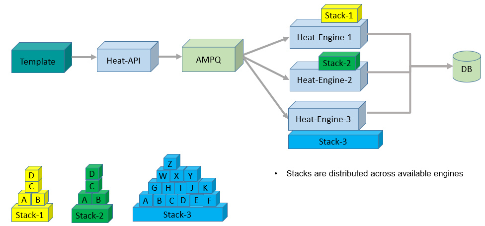
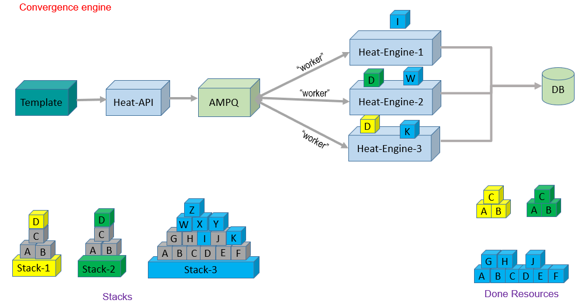

# Introduce about Openstack Heat

## 1. Khái niệm

Heat là thành phần chịu trách nhiệm cho việc điều phối ( Orchestration ) trong Openstack. Heat thực hiện việc quản lý vòng đời các ứng dụng openstack bằng cách sử dụng templates, định nghĩa liên kết giữa các tài nguyên.

Là phần mềm tích hợp với các thành phần trong Openstack nhằm sử dụng tài nguyên của các thành phần đó để xây dựng và quản lý cơ sở hạ tầng ứng dụng trên Openstack.

## 2. Thành phần 


|Tên|Loại|Mô tả|
|---|---|---|
|Heat|Command line client|là CLI phục vụ giao tiếp với heat-api và thực hiện chạy lệnh Orchestration thông qua AWS CloudFormation APIs|
|Heat-api|thành phần|cung cấp OpenStack-native REST API tiếp nhận các yêu cầu API gửi tới và sau đó gửi đến Heat-engine thông qua RPC để xử lý.|
|Heat-api-cfn|thành phần|cung cấp API truy vấn AWS tương thích với AWS CloudFormation và xử lý các yêu cầu API  bằng cách gửi chúng tới heat-engine thông qua RPC.|
|Heat-engine|thành phần chính|Là core engine có nhiệm vụ điều phối việc khởi tạo templates và cung cấp các sự kiện cho người dùng API.|


## 3. Workflow


- Bước 1: Người dùng khởi tạo và stack bằng template thông qua CLI hoặc Openstack-dashboard

- Bước 2: Heat API gửi yêu cầu chạy stack xuống AMQP

- Bước 3: Heat Engine lấy yêu cầu từ AMQP

- Bước 4: Lưu trữ thông tin stack vào Database

- Bước 5: Heat Engine sẽ phân tích stack thông qua kịch bản trong template và gửi yêu cầu đó xuống các API của các resource sẽ khởi tạo.

- Bước 6: API của các resource ( Glance, Nova, Neutron, Cinder) sẽ kiểm tra các yêu cầu từ Stack có khớp hoặc sẵn sàng để khởi tạo theo yêu cầu.

- Bước 7: Các thành phần trong Openstack gửi thông tin về tài nguyên đã khởi tạo về cho Heat metadata

- Bước 8: Heat metadata phản hồi lại cho Heat Engine về thông tin các tài nguyên đã khởi tạo thông qua AMQP

- Bước 9: Heat Engine sẽ ghi lại thông tin đó vào DB rồi sau đó thông báo trạng thái khởi tạo thành công cho user

## 4. Cơ chế Heat Engine

Có 2 cơ chế Heat engine sẽ xử lý một stack hoặc nhiều stack.
- Heat legacy engine
- Heat convergence engine


### 4.1 Heat legacy engine

Đây là cơ chế mặc định khi cài đặt Heat.

Mỗi stack khi chạy sẽ được đưa vào engine riêng biệt để xử lý, mỗi engine chỉ xử lý một stack đến khi hoàn tất mới tiếp nhận.




### 4.2 Heat convergence engine

Để bật cơ chế xử lý này cấu hình trong `/etc/heat/heat.conf`:
```ini
[DEFAULT]
...
convergence_engine = true
```
Đây là cơ chế sẽ phân nhỏ stack ra để đưa vào nhiều engine xử lý.

Mỗi một khối ở hình dưới được coi như là một tài nguyên khởi tạo trên mỗi thành phần của openstack. Khi một stack được xác nhận khởi tạo.  Heat API sẽ phân nhỏ từng khối tài nguyên rồi đẩy vào cho AMQP, từ đó tất cả các engine sẽ ngẫu nhiên lấy request từ AMQP để khởi tạo tài nguyên. Sau đó gắn id, lưu trạng thái vào DB.



### 4.3 So sánh 2 cơ chế

||Legacy|Convergence|
|---|---|---|
|Graph/Progress Info|Trong memory|Trong database|
|Load distribution|Stack chạy trên 1 engine|Tài nguyên stack được phân phối chạy trên nhiều engine|
|Concurrent Update|Không|Có|

