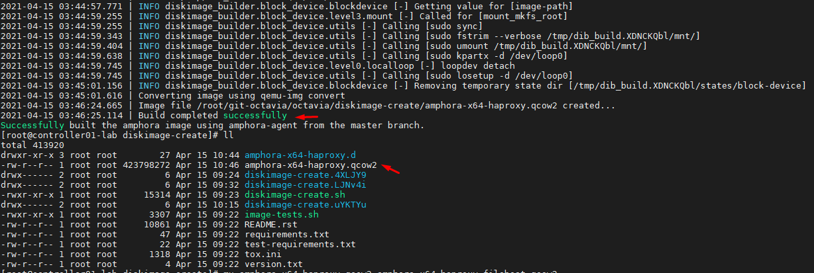

# Build Amphora Image

Bài viết này sẽ hướng dẫn đóng Image Amphora cho project Octavia

- Bước 1: Clone các git repository cần thiết
```sh
git clone https://github.com/stackforge/octavia.git
git clone https://git.openstack.org/openstack/diskimage-builder.git
git clone https://git.openstack.org/openstack/tripleo-image-elements.git
```

- Bước 2: Chuyển branch sang train ( Bởi vì tôi muốn sử dụng OS centos7)
```sh
cd octavia/
git checkout stable/train
```


- Bước 3: Thêm các elements để custom cho Image nếu cần thiết. Ở đây tôi sẽ cài đặt filebeat trong Image này 
```sh 
mkdir -p elements/filebeat/post-install.d
```

- Bước 4: Chỉnh sửa file script elements/filebeat/post-install.d/centos-filebeat với nội dung:
```sh
#!/bin/bash

echo "Install FileBeat"

sudo rpm --import https://artifacts.elastic.co/GPG-KEY-elasticsearch

echo "Config filebeat repo"
cat << EOF > /etc/yum.repos.d/filebeat.repo
[filebeat-7.x]
name=Filebeat repository for 7.x packages
baseurl=https://artifacts.elastic.co/packages/7.x/yum
gpgcheck=1
gpgkey=https://artifacts.elastic.co/GPG-KEY-elasticsearch
enabled=1
autorefresh=1
type=rpm-md
EOF

echo "Install Filebeat"

yum -y install filebeat

echo "Enable service filebeat"

systemctl enable filebeat

echo "Config Filebeat"

cat <<EOF > /etc/filebeat/filebeat.yml
filebeat.inputs:
- type: log
  enabled: false
  paths:
    - /var/log/*.log
- type: filestream
  enabled: false
  paths:
    - /var/log/*.log
filebeat.config.modules:
  path: \${path.config}/modules.d/*.yml
  reload.enabled: false
setup.template.settings:
  index.number_of_shards: 1
setup.kibana:
output.elasticsearch:
  hosts: ["localhost:9200"]
processors:
  - add_host_metadata:
      when.not.contains.tags: forwarded
  - add_cloud_metadata: ~
  - add_docker_metadata: ~
  - add_kubernetes_metadata: ~
EOF
```
- Bước 5: Phân quyền cho script
```sh
chmod +x elements/filebeat/post-install.d/centos-filebeat
```

- Bước 6: Ở phiên bản diskimage-create của Octavia này xuất hiện lỗi không cài đặt `haproxy` và module `pbr`

    - Lỗi không cài HAproxy: thêm cài đặt tại file `octavia/elements/haproxy-octavia/install.d/76-haproxy`
    ```sh
    #!/bin/bash
    set -eux
    set -o pipefail
    ## Đoạn thêm
    if [ "$DISTRO_NAME" == "centos" ] && [ "$DIB_RELEASE" == "7" ]; then
        yum -y install haproxy
    fi
    ##
    [ -d /var/lib/haproxy ] || install -d -D -m 0755 -o root -g root /var/lib/haproxy
    ```

    - Lỗi không cài moldule `pbr`: Thêm dòng cài đặt tại file `octavia/elements/amphora-agent/install.d/amphora-agent-source-install/75-amphora-agent-install`
    ```sh
    #!/bin/bash

    if [ ${DIB_DEBUG_TRACE:-0} -gt 0 ]; then
        set -x
    fi
    set -eu
    set -o pipefail

    SCRIPTDIR=$(dirname $0)
    AMP_VENV=/opt/amphora-agent-venv

    # Create a virtual environment to contain the amphora agent
    ${DIB_PYTHON} -m virtualenv $AMP_VENV

    $AMP_VENV/bin/pip install pip --upgrade
    ### ĐOẠN THÊM
    $AMP_VENV/bin/pip install pbr
    ### 
    $AMP_VENV/bin/pip install -U -c /opt/upper-constraints.txt /opt/amphora-agent

    # Link the amphora-agent out to /usr/local/bin where the startup scripts look
    ln -s $AMP_VENV/bin/amphora-agent /usr/local/bin/amphora-agent || true

    # Also link out the vrrp check script(s) so they're in PATH for keepalived
    ln -s $AMP_VENV/bin/haproxy-vrrp-* /usr/local/bin/ || true

    mkdir /etc/octavia
    # we assume certs, etc will come in through the config drive
    mkdir /etc/octavia/certs
    mkdir -p /var/lib/octavia

    install -D -g root -o root -m 0644 ${SCRIPTDIR}/amphora-agent.logrotate /etc/logrotate.d/amphora-agent

    case "$DIB_INIT_SYSTEM" in
        upstart)
            install -D -g root -o root -m 0644 ${SCRIPTDIR}/amphora-agent.conf /etc/init/amphora-agent.conf
            ;;
        systemd)
            install -D -g root -o root -m 0644 ${SCRIPTDIR}/amphora-agent.service /usr/lib/systemd/system/amphora-agent.service
            ;;
        sysv)
            install -D -g root -o root -m 0644 ${SCRIPTDIR}/amphora-agent.init /etc/init.d/amphora-agent.init
            ;;
        *)
            echo "Unsupported init system"
            exit 1
            ;;
    esac
    ```
- Bước 7: chỉnh sửa lệnh chạy diskimage-create để khai báo thêm element `filebeat` trong file `octavia/diskimage-create/diskimage-create.sh`
```sh
#...
disk-image-create $AMP_LOGFILE $dib_trace_arg -a $AMP_ARCH -o $AMP_OUTPUTFILENAME -t $AMP_IMAGETYPE --image-size $AMP_IMAGESIZE --image-cache $AMP_CACHEDIR $AMP_DISABLE_TMP_FS $AMP_element_sequence filebeat
#...
```
- Bước 8: Khai báo cài đặt pip và virtualenv bằng package
```sh
export DIB_INSTALLTYPE_pip_and_virtualenv=package
```

- Bước 9: Thực hiện chạy lệnh build image
```sh
cd octavia/diskimage-create/
./diskimage-create.sh  -d 7 -i centos  -s3
```





## Kiểm tra


- Đổi tên 
```sh
mv amphora-x64-haproxy.qcow2 amphora-x64-haproxy-filebeat.qcow2
```
- Chuyển định dạng Image
```sh
qemu-img convert -f qcow2 -O raw  amphora-x64-haproxy-filebeat.qcow2 amphora-x64-haproxy-filebeat.raw
```
- upload image lên Openstack dồng thời gắn tag cho image
```sh
openstack image create --disk-format raw --container-format bare --private --tag amphora-filebeat --file amphora-x64-haproxy-filebeat.raw amphora-filebeatx64-haproxy
```


- Khởi tạo loadbalancer


- Kiểm tra amphora


----
## TK

[1] https://opendev.org/openstack/octavia/commit/9df9ff9137af0d4602283232dc1352cb6b43a3d1

[2] https://ask.openstack.org/en/question/116606/how-to-create-an-amphora-image-for-octavia/