# VPN client to site

*Trong bài viết này sẽ hướng dẫn sử dụng OpenVPN cài đặt trên Laptop Window kết nối tới VMs dải private, thông qua một VM Pfsense trên hệ thống Openstack*

*Thực hiện cài đặt server Pfsense phiên bản 2.5.1* (Hướng dẫn cài đặt [tại đây](https://github.com/longsube/Tim-hieu-pfSense/blob/master/docs/pfSense-install.md))

## Mô hình hệ thống 

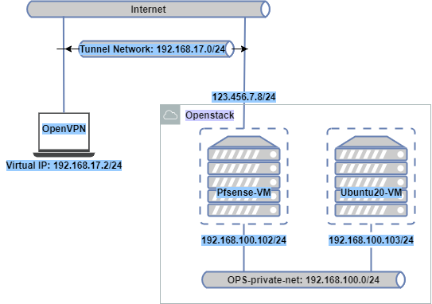

## Thiết lập VPN phía Pfsense

- Bước 1: Khởi tạo CAs

    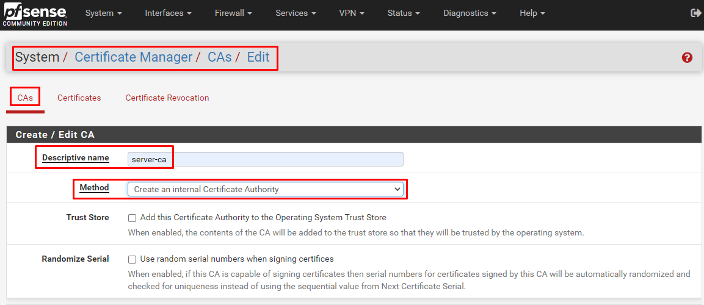

    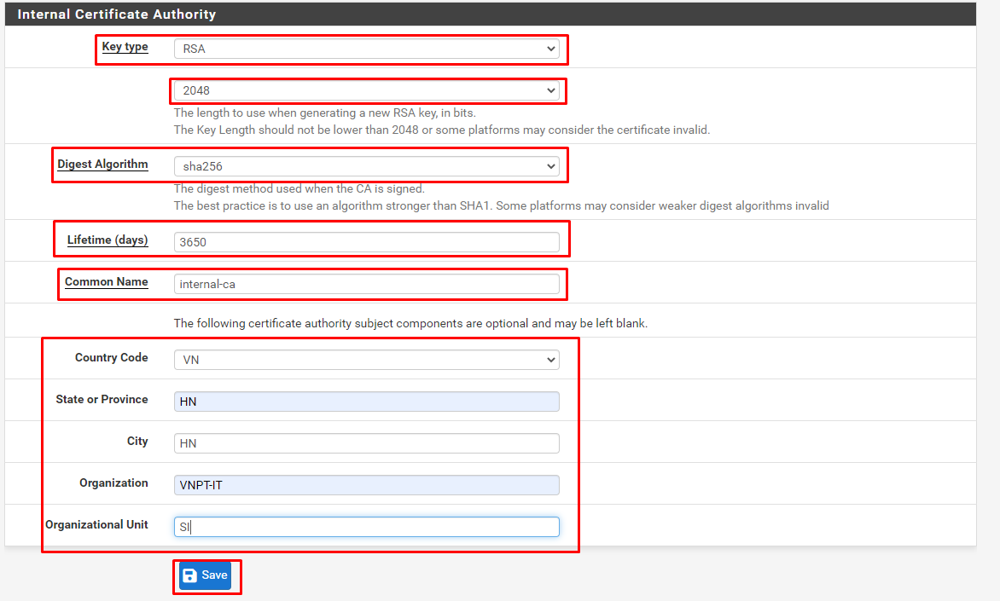

- Bước 2: Khởi tạo Cert cho Server

    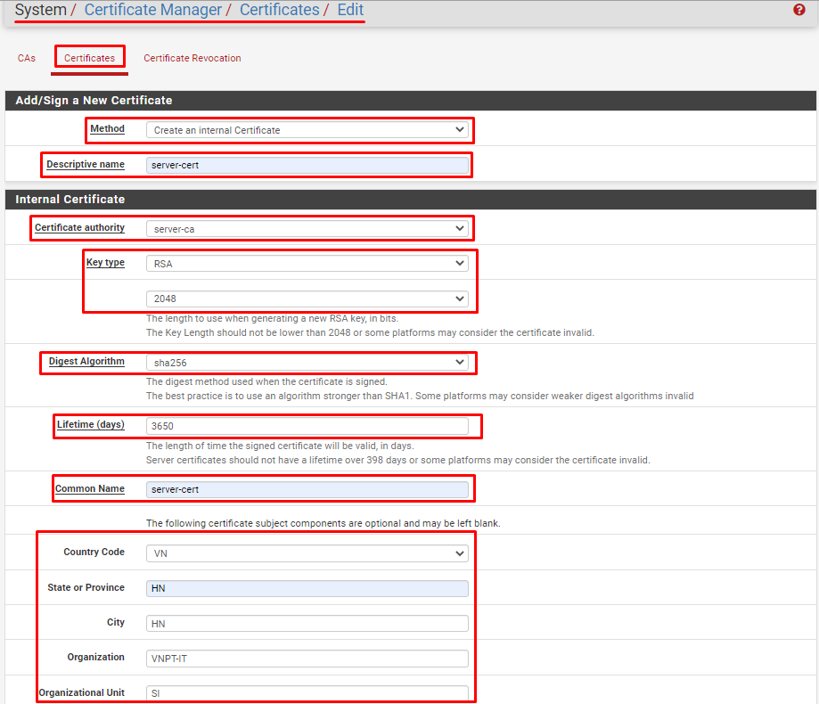

    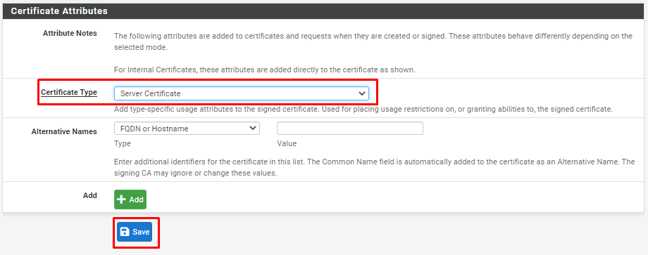

- Bước 3: Khởi tạo cert cho User

    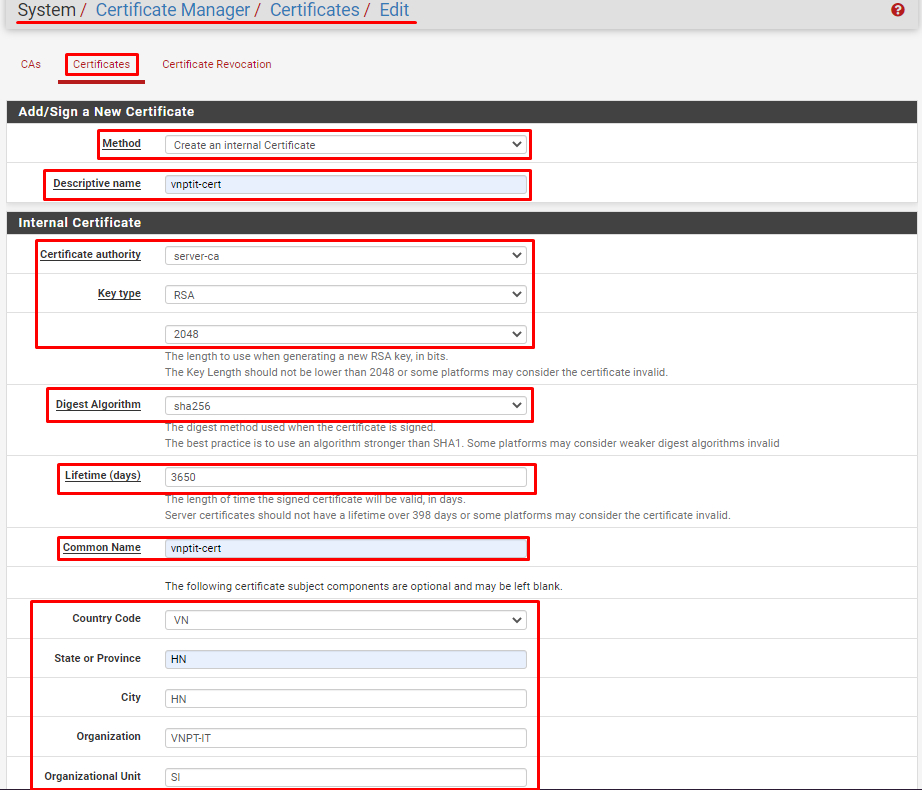

    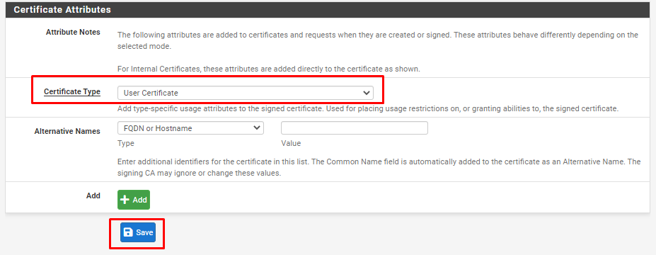

- Bước 4: Tạo user 

    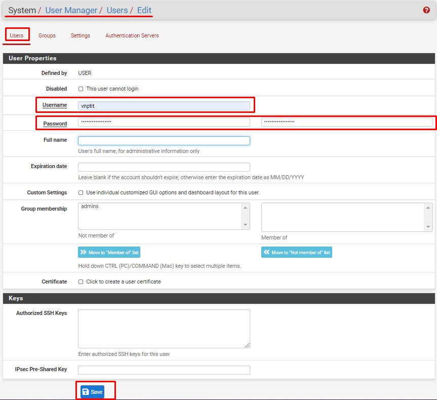

- Bước 5: Import Cert cho user

    

- Bước 6: Tải VPN Client Export

    

- Bước 7: Khởi tạo OpenVPN Server

    - `Server mode: Remote Access (SSL/TLS + User Auth)` Chọn mode Remote Access và xác thực qua cert và user passwords
    - `Backend for authentication: Local Database` Chọn Backend đang lưu trữ thông tin user
    - `Protocol: UDP IPV4 and IPV6 on all interfaces` Chọn Protocol sẽ giao tiếp là UDP trên tất cả các interfaces
    - `Local port: 1194` Port UDP
    - `Description: VPN-VNPT-IT-TUN` Khai báo tên server

    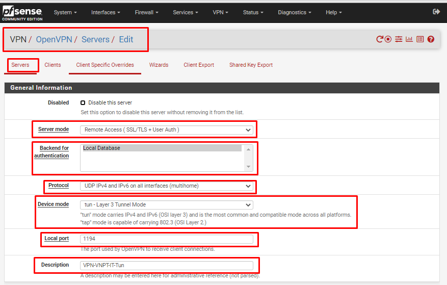

    - `Peer Certificate Authority: server-ca` CA đã tạo ở bước 1
    - `Server certificate: server-cert` Cert dành cho server đã tạo ở bước 2

    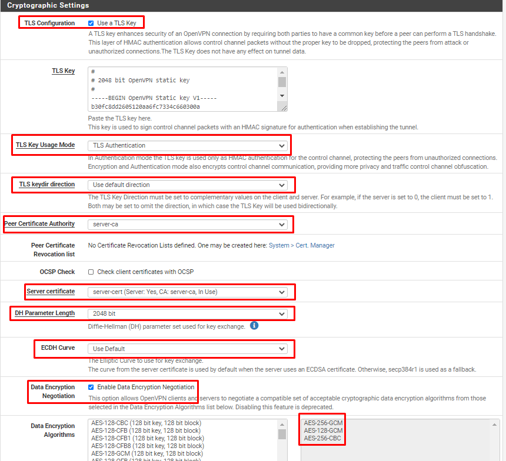

    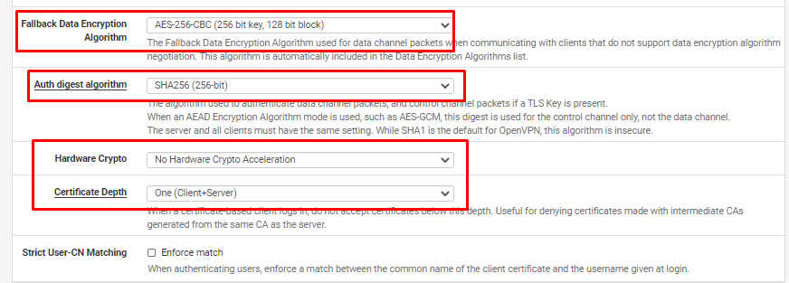

    - `IPv4 Tunnel Network: 192.168.17.0/24` Virtual network tự khai báo cấp DHCP cho các clients
    - `IPv4 local networks: 192.168.100.0/24` Dải Private network mà client muốn kết nối tới
    - `Concurrent connections: 20` Số lượng clients có thể kết nối đồng thời đến OpenVPN server

    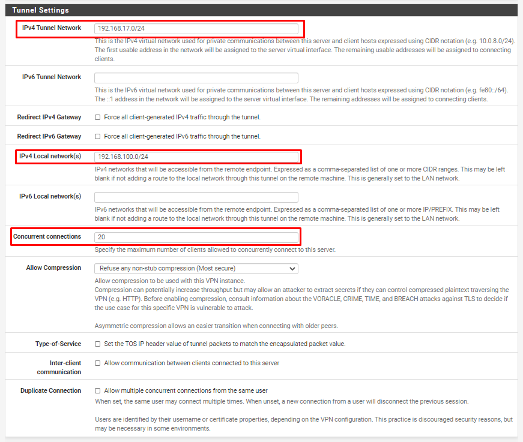

    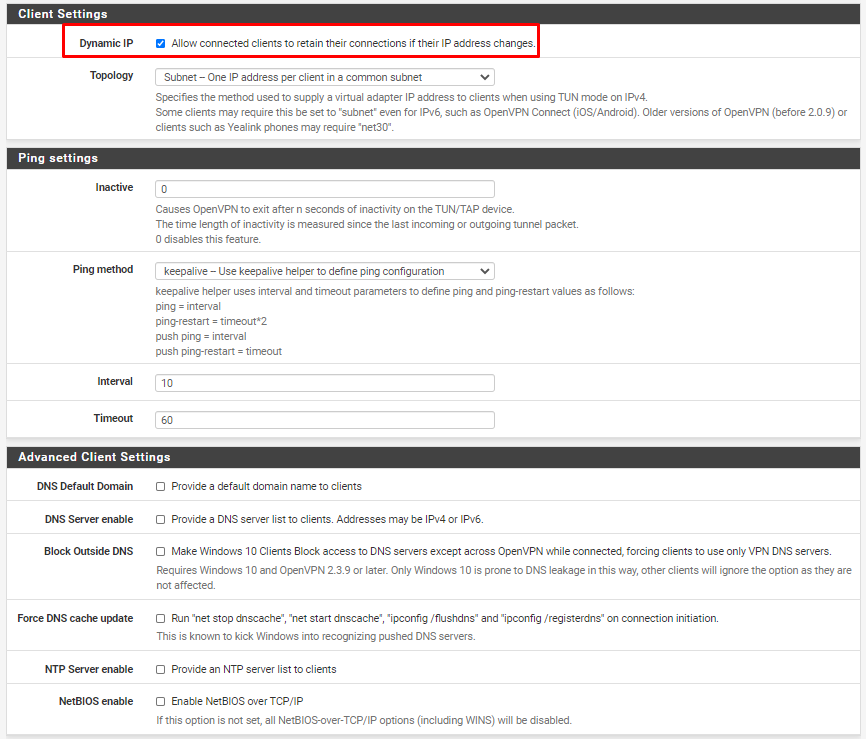

    - `Custom options: route 192.168.100.0 255.255.255.0` Add route cho client

    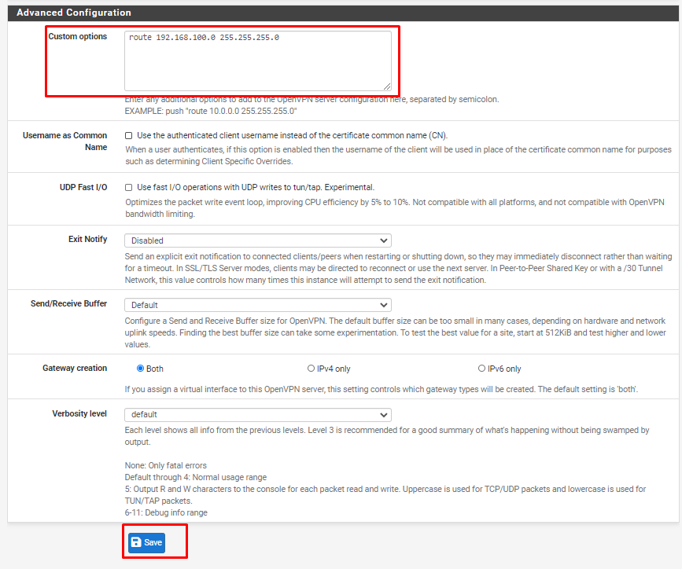

- Bước 8: Add Interface cho OpenVPN server

    

    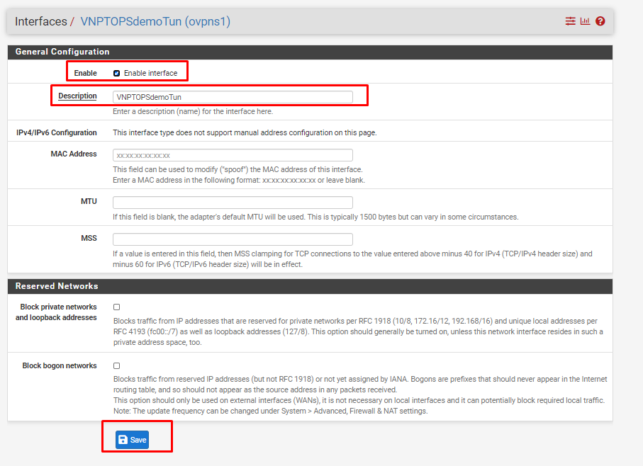

- Bước 9: Mở hết rules cho các Interface trên Pfsense

- Bước 10: Thực hiện lưu lại OpenVPN server đã tạo ở bước 7 lần nữa để lấy cấu hình cho OpenVPN Interface

    *Kết quả OpenVPN Interface lấy được IP*

    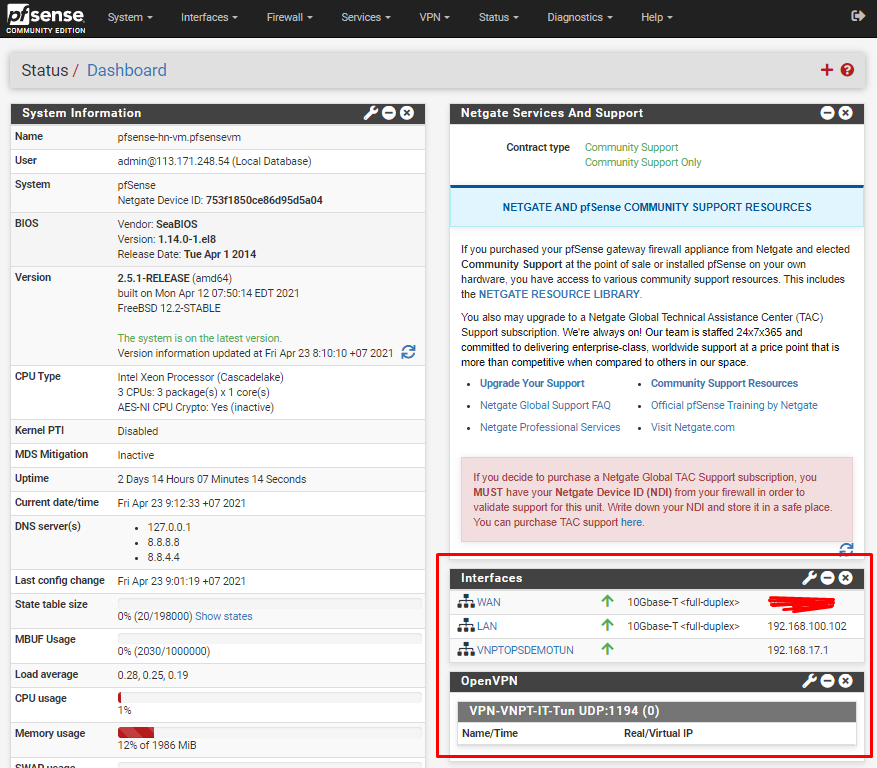

- Bước 11: Client Export, Khai báo, Lưu lại và Download cert và cấu hình

    - `Remote Access Server: VPN-VNPT-IT-TUN:1194` OpenVPN server đã tạo ở bước 7
    - `Host Name Resolution: Other`
    - `Host Name: 123.456.7.8` Là IP WAN của Pfsense

    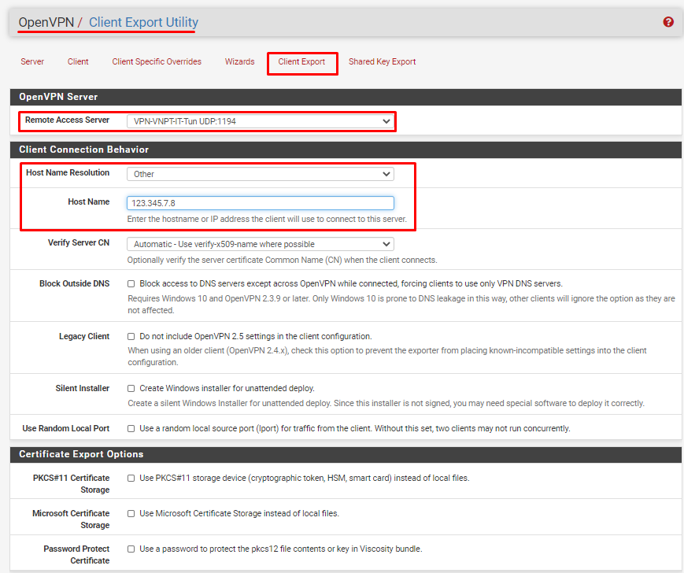

    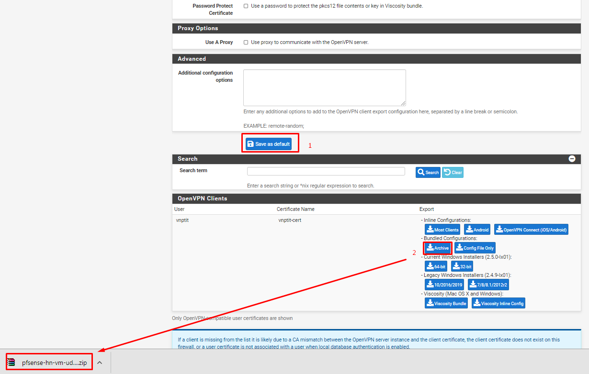

## Thực hiện trên Client OpenVPN

- Bước 1: Copy toàn bộ cert và cấu hình vào thư mục `C:\Program Files\OpenVPN\config` ( tùy bạn lưu config cho OpenVPN ở đâu)

- Bước 2: Khởi động lại OpenVPN và kết nối 

    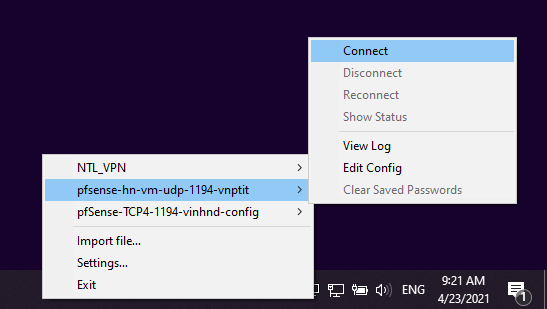

    - Khai báo user passwords

    

    - Check lại log

    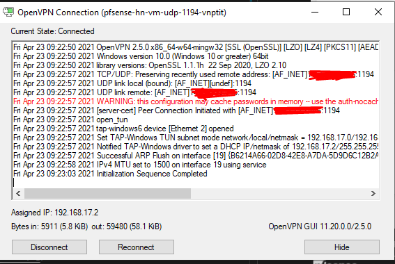

----
 
## Tài liệu chi tiết xem tại đây:

[1] https://github.com/longsube/Tim-hieu-pfSense/blob/master/docs/pfSense-OpenVPN-TUNmode.md

[2] https://github.com/longsube/Tim-hieu-pfSense/blob/master/docs/pfSense-OpenVPN-TUN-OpenStackVM.md

[3] https://github.com/longsube/Tim-hieu-pfSense/blob/master/docs/pfSense-install.md